# Computer Graphics with OpenGL and Python

This set of examples illustrate different computer graphics concepts in 2D and 3D while using: Python, OpenGL core profile, GLFW and Numpy.
    
## Raster

    
### ex_color_palette.py
Simulating an indirect color scheme with matplotlib
    
[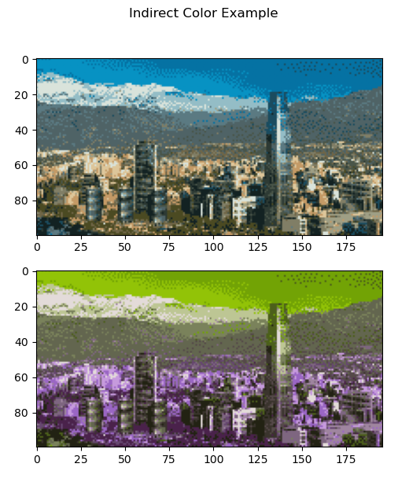](./examples/ex_color_palette.py)
    
### ex_color_palette_anim.py
Animation changing the color palette  while simulating an indirect color scheme with matplotlib
    
[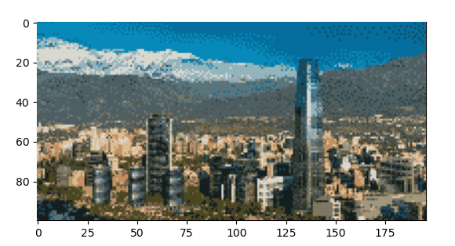](./examples/ex_color_palette_anim.py)
    
### ex_sira_direct.py
Using a direct color scheme with sira
    
[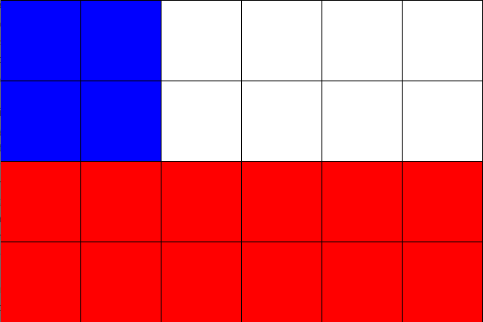](./examples/ex_sira_direct.py)
    
### ex_sira_indirect.py
Using an indirect color scheme with sira
    
[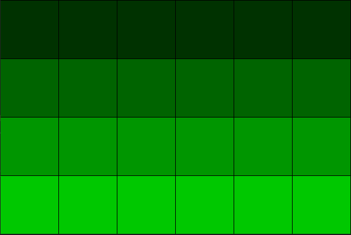](./examples/ex_sira_indirect.py)
    
## OpenGL Basics

    
### opengl_version.py
Sample code to determine OpenGL version available on the current machine.
It attempts to set OpenGL core profile 3.3.
    
### ex_triangle.py
Hello OpenGL!
    
[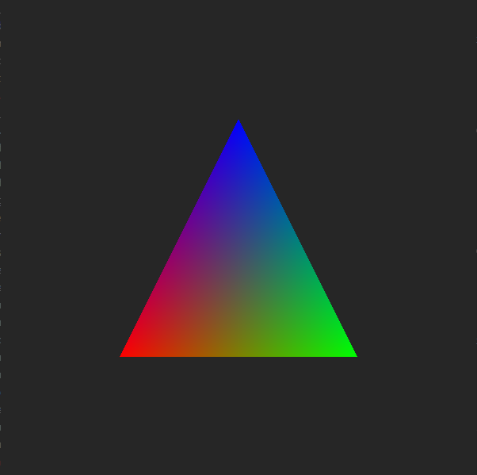](./examples/ex_triangle.py)
    
### ex_quad.py
Drawing a Quad via a EBO
    
[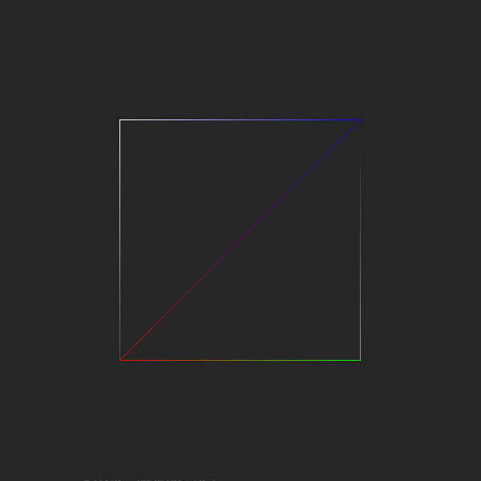](./examples/ex_quad.py)
    
### ex_cube.py
Drawing a simple cube with OpenGL
    
[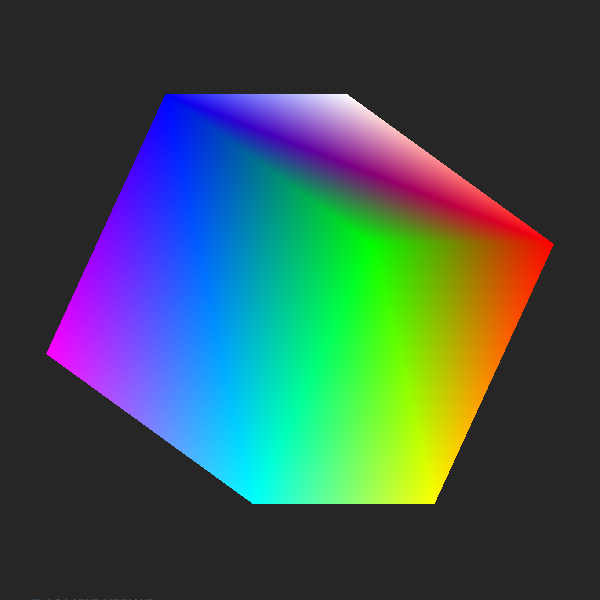](./examples/ex_cube.py)
    
### ex_stream_draw.py
Drawing a deformable shape using GL_STREAM_DRAW
    

    
## Transformations

    
### ex_transform_polygon.py
Drawing and transforming polygons with matplotlib
    
[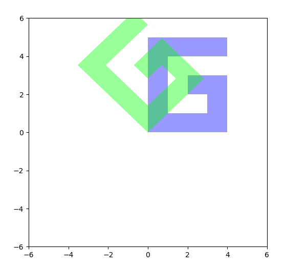](./examples/ex_transform_polygon.py)
    
### ex_cpu_transforms.py
Transforming vertices in the CPU to create shapes.
    
[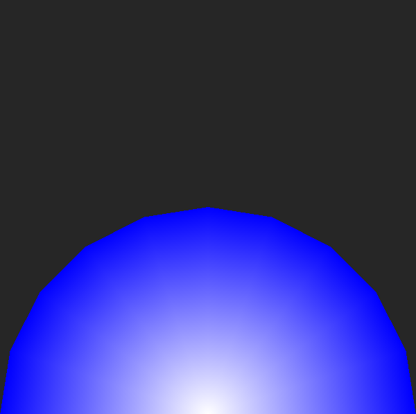](./examples/ex_cpu_transforms.py)
    
### ex_4shapes.py
Drawing 4 shapes with different transformations
    
[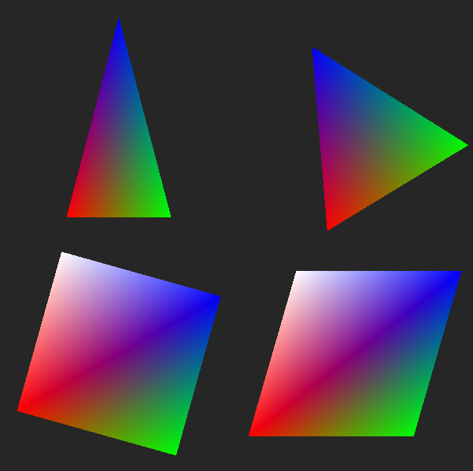](./examples/ex_4shapes.py)
    
### ex_transformations_showcase.py
Ilustrating different transformations
    
[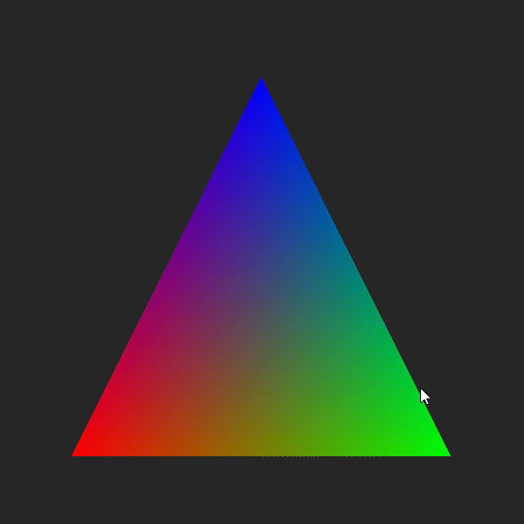](./examples/ex_transformations_showcase.py)
    
### ex_quad_controlled.py
Controlling the movement of a quad
    

    
### ex_transform_imgui.py
Simple example using ImGui with GLFW and OpenGL

More info at:
https://pypi.org/project/imgui/

Installation:
pip install imgui[glfw]

Another example:
https://github.com/swistakm/pyimgui/blob/master/doc/examples/integrations_glfw3.py#L2
    
[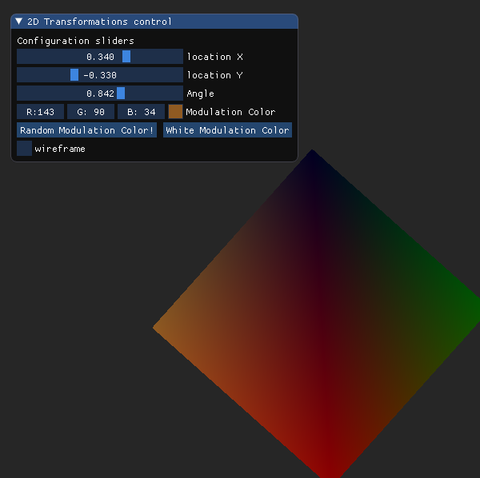](./examples/ex_transform_imgui.py)
    
### ex_mouse.py
Interactions with keyboard and mouse via GLFW/python

More information at:
https://www.glfw.org/docs/latest/input_guide.html

How to convert GLFW/C calls to GLFW/python
https://pypi.org/project/glfw/
    
[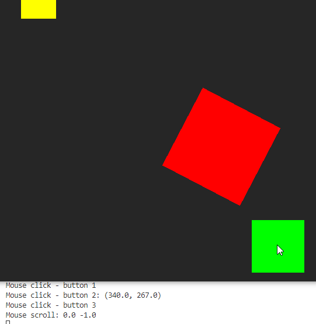](./examples/ex_mouse.py)
    
## Textures

    
### ex_texture_boo.py
Textures and transformations in 2D
    
[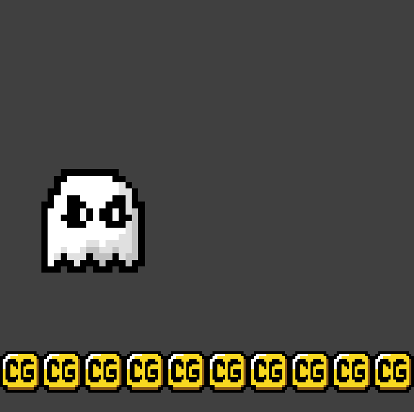](./examples/ex_texture_boo.py)
    
### ex_texture_quad.py
Texture Quad in 2D
    
[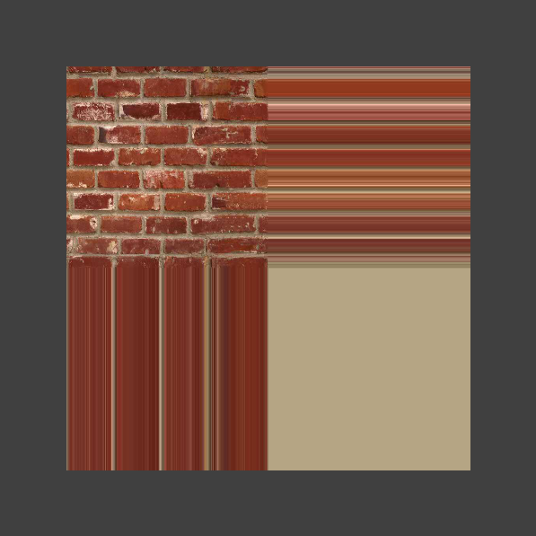](./examples/ex_texture_quad.py)
    
### ex_mipmap.py
Using mipmaps
    

    
### ex_binding_textures.py
Using 2 different textures in the same Fragment Shader
    

    
### ex_text_renderer.py
Example drawing text with OpenGL textures
    
[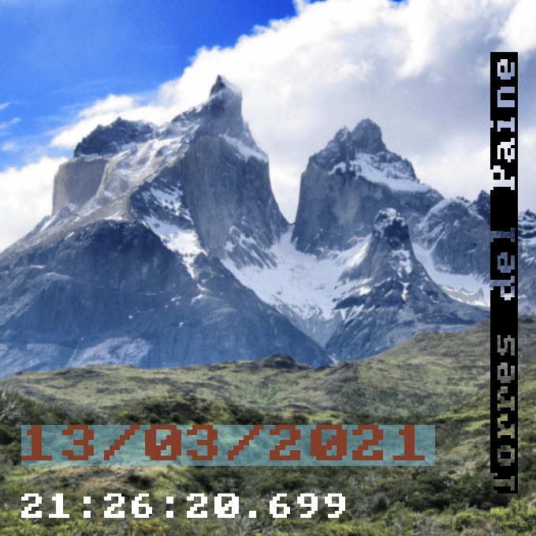](./examples/ex_text_renderer.py)
    
## Scene Graphs

    
### ex_scene_graph_2dcars.py
Drawing many cars in 2D using scene_graph2
    
[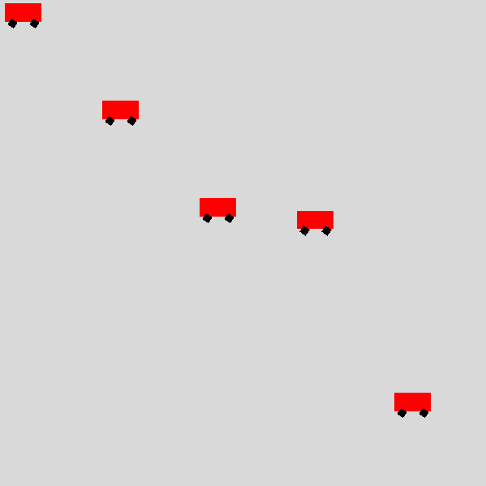](./examples/ex_scene_graph_2dcars.py)
    
### ex_scene_graph_snowman.py
Drawing a Snowman using scene_graph
    

    
## Curves

    
### ex_curves.py
Hermite and Bezier curves using python, numpy and matplotlib
    
[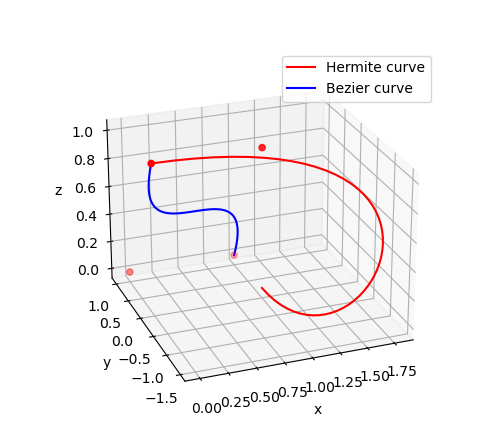](./examples/ex_curves.py)
    
## 3D World

    
### ex_projections.py
Projections example
    
[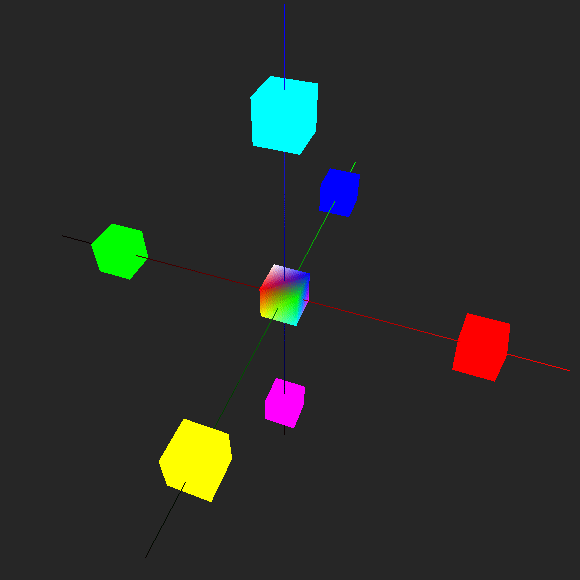](./examples/ex_projections.py)
    
### ex_texture_dice.py
Textures and transformations in 3D
    
[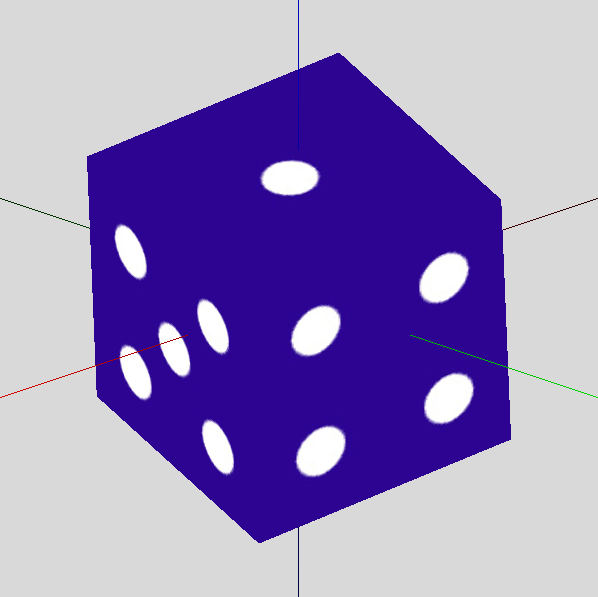](./examples/ex_texture_dice.py)
    
### ex_height_plotter.py
plotting a 2d function as a surface
    
[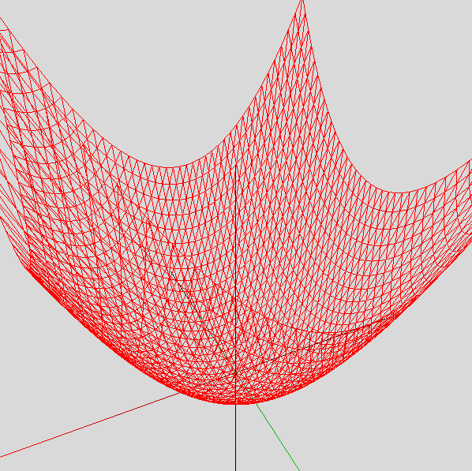](./examples/ex_height_plotter.py)
    
### ex_scene_graph_3dcars.py
Drawing 3D cars via scene graph
    
[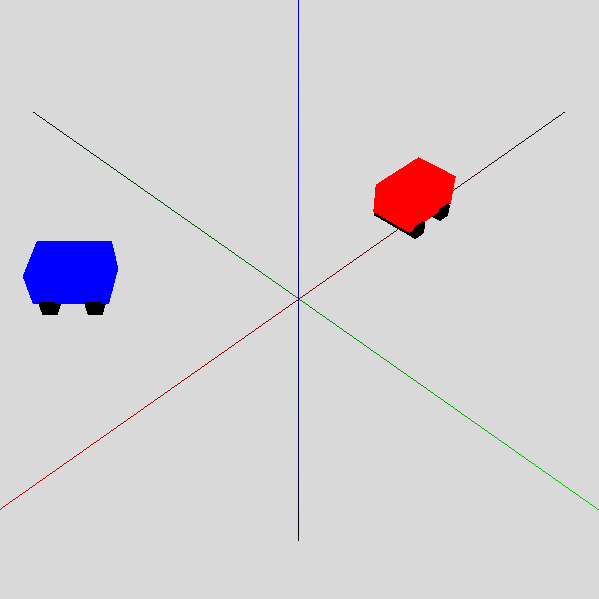](./examples/ex_scene_graph_3dcars.py)
    
### ex_mix2d3d.py
Example drawing 2D over a 3D world.
The trick is to not clear the color buffer after drawing 3D, and then draw 2D with the shader.

If it is required to draw 3D over 2D, you may need to clear the depth buffer with
glClear(GL_DEPTH_BUFFER_BIT)
    
[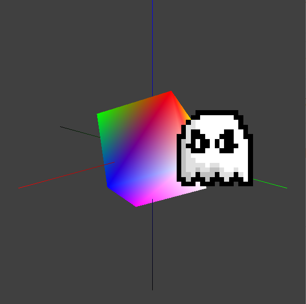](./examples/ex_mix2d3d.py)
    
### ex_surface.py
Bezier Surface using python, numpy and matplotlib
    
[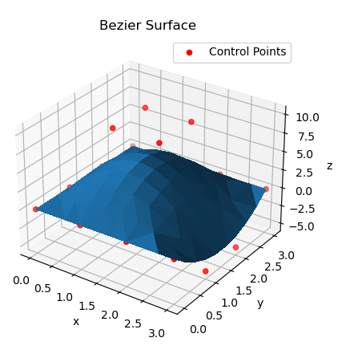](./examples/ex_surface.py)
    
## Shading and Lighting

    
### ex_lighting.py
Showing lighting effects: Flat, Gauraud and Phong
    
[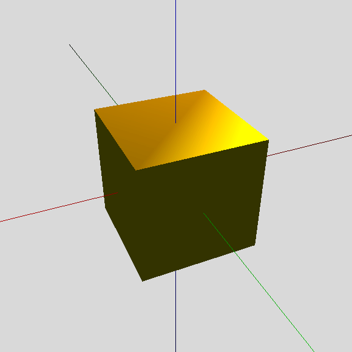](./examples/ex_lighting.py)
    
### ex_lighting_texture2.py
Showing lighting effects over two textured objects: Flat, Gauraud and Phong
    
[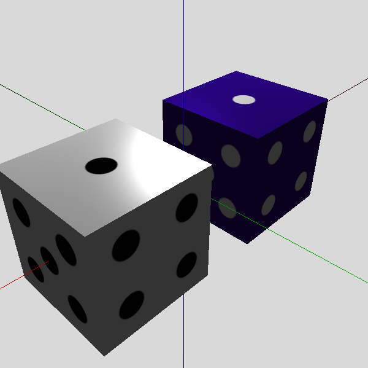](./examples/ex_lighting_texture2.py)
    
### ex_obj_reader.py
Rendering a OBJ file simplified
    
[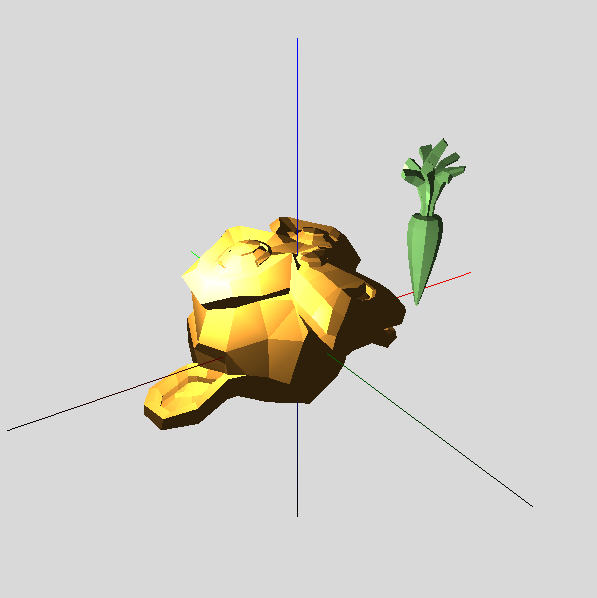](./examples/ex_obj_reader.py)
    
## Meshes

    
### ex_delaunay.py
Using Delaunay triangluation from the scipy library

documentation:
https://docs.scipy.org/doc/scipy-0.14.0/reference/generated/scipy.spatial.Delaunay.html
    
[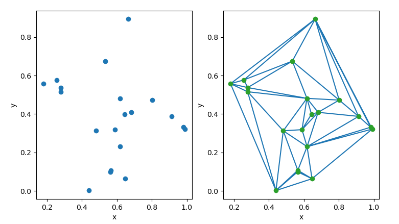](./examples/ex_delaunay.py)
    
### ex_triangle_mesh.py
Face based data structure for a triangle mesh
    
### ex_triangle_mesh_builder.py
Using the dedicated face based triangle mesh builder
    
### ex_openmesh_pyramid.py
Using OpenMesh to compute normals for lighting effects
    
[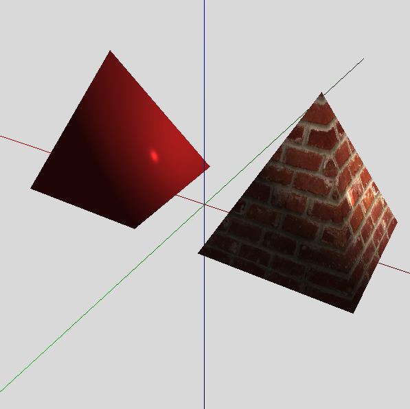](./examples/ex_openmesh_pyramid.py)
    
## Physics and Collisions

    
### ex_collisions.py
Circles, collisions and gravity
    
[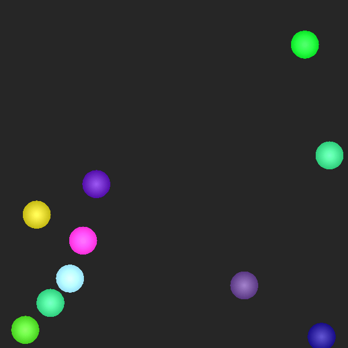](./examples/ex_collisions.py)
    
## Advanced OpenGL

    
### ex_geometry_shader.py
Geometry Shader Basic Example

Adapted from: https://learnopengl.com/code_viewer_gh.php?code=src/4.advanced_opengl/9.1.geometry_shader_houses/geometry_shader_houses.cpp
    
[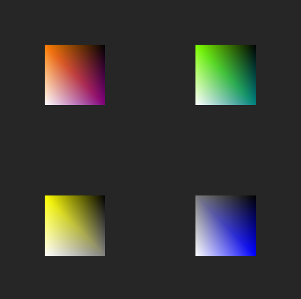](./examples/ex_geometry_shader.py)
    
### ex_render_to_texture.py
Render to Texture Example
    
[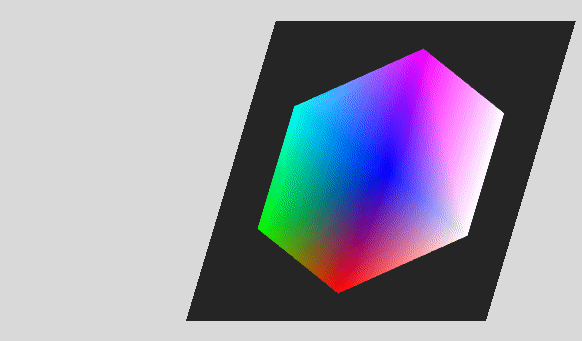](./examples/ex_render_to_texture.py)
    